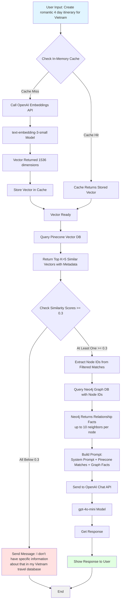

## Instructions to run the hybrid chat

Run redis docker:
docker run -d --name redis -p 6379:6379 -p 8001:8001 redis/redis-stack:latest

### System Flowchart

```mermaid
flowchart TD
    A[User Input: Create romantic 4 day itinerary for Vietnam] --> B{Check In-Memory Cache}

    B -->|Cache Hit| C[Cache Returns Stored Vector]
    B -->|Cache Miss| D[Call OpenAI Embeddings API]

    D --> E[text-embedding-3-small Model]
    E --> F[Vector Returned 1536 dimensions]
    F --> G[Store Vector in Cache]
    G --> H[Vector Ready]
    C --> H

    H --> I[Query Pinecone Vector DB]
    I --> J[Return Top K=5 Similar Vectors with Metadata]

    J --> K{Check Similarity Scores >= 0.3}

    K -->|All Below 0.3| L[Send Message: I don't have specific information<br/>about that in my Vietnam travel database]
    L --> M[End]

    K -->|At Least One >= 0.3| N[Extract Node IDs from Filtered Matches]

    N --> O[Query Neo4j Graph DB with Node IDs]
    O --> P[Neo4j Returns Relationship Facts<br/>up to 10 neighbors per node]
    P --> Q[Build Prompt:<br/>System Prompt + Pinecone Matches + Graph Facts]

    Q --> R[Send to OpenAI Chat API]
    R --> S[gpt-4o-mini Model]
    S --> T[Get Response]
    T --> U[Show Response to User]
    U --> M

    style A fill:#e1f5ff
    style L fill:#ffe1e1
    style U fill:#e1ffe1
    style M fill:#f0f0f0
```
