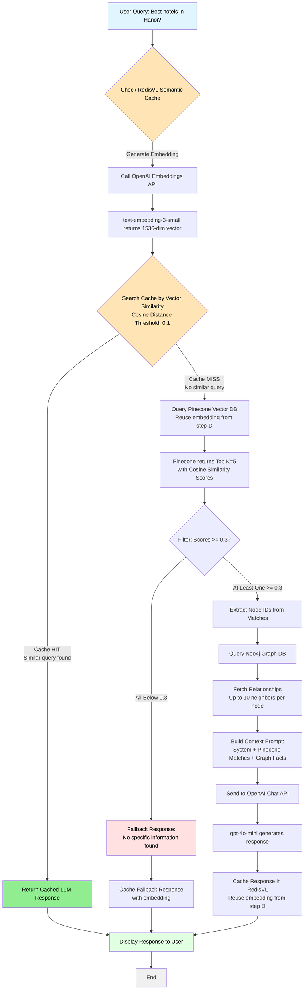

## Instructions to run the hybrid chat

Run redis docker:
```bash
docker run -d --name redis -p 6379:6379 -p 8001:8001 redis/redis-stack:latest
```

### System Flowchart with Semantic Cache



### Cache Strategy

**Semantic Cache (RedisVL)**:
- Caches complete LLM responses based on semantic similarity
- Uses OpenAI embeddings + cosine distance (threshold: 0.1)
- Saves entire pipeline on cache hit: Embedding + Pinecone + Neo4j + GPT

**Optimization**:
- Single embedding API call per request (reused for cache + Pinecone)
- Cache hit skips all downstream operations
- Persistent across restarts
