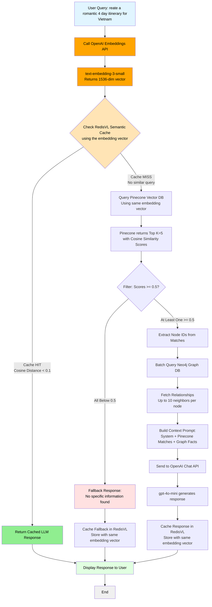

## Architecture overview


## System Flowchart with Semantic Cache



## Instructions to run the hybrid chat

### Prerequisites

**1. Run Redis container:**

```bash
docker run -d --name redis -p 6379:6379 -p 8001:8001 redis/redis-stack:latest
```

**2. Run Neo4j container:**

```bash
docker run -d \
  --name neo4j \
  -p 7474:7474 -p 7687:7687 \
  -e NEO4J_AUTH=neo4j/your_password \
  neo4j:latest
```

**3. Set up environment variables:**

Create a `.env.local` file with:

```bash
# OpenAI
OPENAI_API_KEY=your_openai_api_key

# Pinecone
PINECONE_API_KEY=your_pinecone_api_key
PINECONE_INDEX_NAME=vietnam-travel
PINECONE_VECTOR_DIM=1536

# Neo4j
NEO4J_URI=bolt://localhost:7687
NEO4J_USER=neo4j
NEO4J_PASSWORD=your_password

# Redis
REDIS_HOST=localhost
REDIS_PORT=6379

# Cache Settings
CACHE_ENABLED=true
SEMANTIC_CACHE_ENABLED=true
SEMANTIC_CACHE_THRESHOLD=0.1
```

**4. Install dependencies:**

```bash
pip install -r requirements.txt
```

**5. Run the application:**

```bash
python hybrid_chat.py
```

### Cache Strategy

**Semantic Cache (RedisVL)**:

- Caches complete LLM responses based on semantic similarity
- Uses OpenAI embeddings + cosine distance (threshold: 0.1)
- Saves entire pipeline on cache hit: Embedding + Pinecone + Neo4j + GPT

**Optimization**:

- Single embedding API call per request (reused for cache + Pinecone)
- Cache hit skips all downstream operations
- Persistent across restarts
